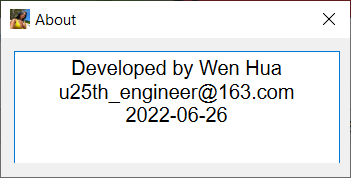

&emsp;&emsp;C++实现了4个经典的字符串模式匹配算法：BF、RK、KMP和BM，并用Qt6完成了GUI。为了便于直观有效地对4个算法进行测试和对比，设计了3种测试模式： 
&emsp;&emsp;1. 单处理； 
&emsp;&emsp;&emsp;&emsp;使用一个测试数据对单个算法进行测试，查看耗时以及结果是否正确； 
&emsp;&emsp;2. 批处理1； 
&emsp;&emsp;&emsp;&emsp;使用整个数据集对单个算法进行测试，对比不同数据量的耗时； 
&emsp;&emsp;3. 批处理2： 
&emsp;&emsp;&emsp;&emsp;使用一个测试数据对4个算法进行测试，对比不同算法的耗时。 

 

&emsp;&emsp;测试文件老是上传失败，需要的朋友自己从[link.txt](./test-data/link.txt)中提供的链接下载。

 

<b>
&emsp;&emsp;PS：合肥工业大学《程序设计与算法训练》（即《数据结构》课程设计）的题目“字符串模式匹配算法比较”可以参考本项目。（毕业老学长奉上，蛤蛤蛤！）

</b>
 
 

&emsp;&emsp;下面的图片除了第1张为程序结构图，其余均是程序截图或生成的坐标图。

 

&emsp;&emsp;Machine Translation Contents with a Little Personal Polished:

 

&emsp;&emsp;Four classical string pattern matching algorithms: BF, RK, KMP and BM are implemented using C++ and GUI is completed by Qt6. What's more, In order to test and compare the four algorithms intuitively and effectively, three test modes are designed:

 

&emsp;&emsp;Single Mode: 
&emsp;&emsp;Use single testbench to test one algorithm, and then to check the time-consuming and whether the results are correct; 

 

&emsp;&emsp;Batch Mode 1: 
&emsp;&emsp;Use the whole data set to test a single algorithm, and then compare the time-consuming over different amounts of data;

 

&emsp;&emsp;Batch Mode 2: 
&emsp;&emsp;Use single testbench to test the four algorithms, and then compare the time-consuming of each algorithms.

 

&emsp;&emsp;If you need the testbench used during development, please download them yourself from the link provided in [link.txt](./test-data/link.txt).

 

&emsp;&emsp;The following pictures except the first one is the program structure diagram than the rest are program screenshots or generated coordinates.

 

    
     
    
Figure 1

 

    
     
    
Figure 2

 

    
     
    
Figure 3

 

    
     
    
Figure 4

 

    
     
    
Figure 5

 

    
     
    
Figure 6

 

    
     
    
Figure 7

 

    
     
    
Figure 8

 

    
     
    
Figure 9

 

    
     
    
Figure 10

 

    
     
    
Figure 11

 

    
     
    
Figure 12

 

    
     
    
Figure 13

 

    
     
    
Figure 14

 

    
     
    
Figure 15

 

    
     
    
Figure 16

 

    
     
    
Figure 17

 

    
     
    
Figure 18

 

    
     
    
Figure 19

 

    
     
    
Figure 20

 

    
     
    
Figure 21

 

    
     
    
Figure 22

 

    
     
    
Figure 23

 

    
     
    
Figure 24

 

    
     
    
Figure 25

 

    
     
    
Figure 26

 

    
     
    
Figure 27

 
